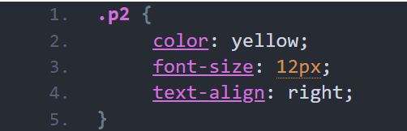

# CSS: Cascading Style Sheets
### Laatste update: 16 mei 2023 door Yasmine Bouhajra
CSS beschrijft hoe HTML elementen moeten worden weergegeven op het scherm. Met HTML kan je elementen (HTML tags) van een website structureren, zoals het invoegen van hoofdstukken, paragrafen, video’s en afbeeldingen. Met CSS kan je bijvoorbeeld bepalen waar deze elementen moeten komen op het scherm, hoe groot het moet zijn en wat de kleur is. HTML kan je zien als de fundering van een huis en CSS zorgt voor het uiterlijk en de inrichting. Wil je meer weten over HTML? Bekijk de vorige blog dan! 

  In deze blog leer je meer over de belangrijkste CSS selectors, de geschiedenis van CSS en de beste leermethodes.

## CSS selectors

CSS selectors kunnen HTML elementen vinden. Dit zijn de belangrijkste selectors:

### HTML elementen stijlen 

Een HTML kan gemakkelijk bewerkt worden. Een element schrijf je in een HTML document op deze manier: < p >< /p >. In CSS hoef je deze <> tekens niet te gebruiken en zet je in het geval van een paragraaf alleen een p neer.

### HTML stijlen met een id 

In een HTML document kan je HTML elementen een id geven. In CSS kan je een id selecteren en stijlen. Hieronder een voorbeeld.

Een paragraaf in een HTML document met een id:

< p id="p1">< /p>

De paragraaf stijlen in CSS met “p1” als id:

In CSS selecteer je het id van een HTML element met # en daarachter de naam van het id. Op deze manier wordt alleen het HTML element met de desbetreffende id gestijld, in dit geval een paragraaf met id “p1”. De paragraaf met id “p1” is in dit geval groen, heeft een lettertypegrootte van 20 pixels en er is 10 pixels afstand tussen de woorden.

### HTML stijlen met een class

Je kan ook HTML elementen een class geven en deze class stijlen in CSS. Hieronder een voorbeeld.

Een paragraaf in een HTML document met een class:

< p class="p2">< /p>

De paragraaf stijlen in CSS met “p2” als class:

### Het verschil tussen een class en een id

De werking van een id en een class lijken op elkaar. Echter is een id bedoeld om één HTML element te identificeren en een class is bedoeld om er meerdere te identificeren. Je kan wel dezelfde id in meerdere HTML elementen zetten, maar dan kan je later in de problemen komen als je ook JavaScript wil gebruiken.

## Waarom is CSS eigenlijk ontstaan? 

CSS1 is gereleased in 1996 en kwam opnieuw uit in 1999 zonder de fouten die er eerst in zaten. Het idee erachter was om de content en de presentatie van een website van elkaar te scheiden. HTML is bedoeld voor de content en CSS voor het stijlen van een website. De scheiding tussen content en presentatie maakt het overzichtelijker en makkelijker om dingen aan te passen.

Het duurde even voordat alle browsers goed konden omgaan met CSS, maar tegenwoordig is CSS niet meer weg te denken bij het maken van een website. Het is makkelijk om te leren en je kan er snel mee aan de slag.

## Wat zijn nu de beste leermethodes voor CSS?

Door middel van CSS boeken kan je CSS leren. Op Pluralsight kan je ook videocursussen vinden. Blijf vooral niet stilzitten na de boeken en/of cursussen en ga zelf op onderzoek uit. Begin bijvoorbeeld met het maken van een eenvoudige website en breid daarbij je CSS skills steeds verder uit.

## Bronvermelding

Voor deze blog raadpleegde ik deze website. Wil je meer weten over CSS? Surf dan naar...

https://programmeerplaats.nl/css-leren/
