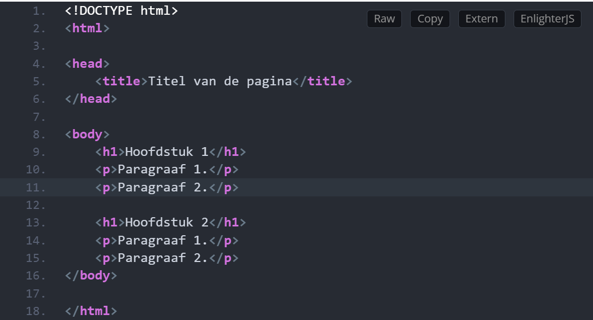

# HTML: HyperText Markup Language 

### Laatste update: 15 mei 2023 door Yasmine Bouhajra

HTML is een opmaaktaal dat noodzakelijk is voor het bouwen van een website. Het beschrijft de opmaak/structuur van een webpagina. Deze markup language is makkelijk te leren. 

In deze blog leer je meer over HTML-tags en atributen, de geschiedenis van HTML en de beste leermethodes. 

## HTML-Tags

Op de foto zie je duidelijk hoe HTML eruit ziet. Je ziet HTML-elementen, zoals bijvoorbeeld head, body, title, p, h1, etc. De meeste HTML elementen bestaan uit een openings- en sluitingstag. Er bestaan ook elementen zonder sluitings-tag. Bijvoorbeeld p is de openingstag en /p is de sluitingstag van een paragraaf. Daartegenover heb je bijvoorbeeld een img tag. Deze HTML tag heeft geen sluitingstag nodig. 

## Atributen 

Nu weet je wat HTML-tags zijn, maar deze tags kunnen ook atributen hebben. De HTML attributen moeten altijd staan in het openingsgedeelte van een HTML tag. Een mooi voorbeeld zie je hieronder:

## Waarom is HTML eigenlijk ontstaan? 

Misschien is het ook wel interessant om in de geschiedenis van HTML te duiken. HTML is in 1991 ontwikkeld door Tim-Berners Lee. Hij ontwikkelde HTML, omdat hij wetenschappelijke documenten beter bereikbaar wilde maken. De eerste webbrowser, WorldWideWeb, is ook door Tim-Berners-Lee ontwikkeld. Deze webbrowser kon HTML begrijpen en omzetten in een visuele webpagina. Nu is dat een vereiste voor elke webbrowser. 
Er was een standaard nodig waardoor iedereen op een gemakkelijke manier documenten op het web met elkaar kon delen. Daarom is HTML makkelijk om te leren, omdat het eenvoudig is opgezet. HTML is uitgegroeid tot een standaard opmaaktaal voor websites.

## Wat zijn nu de beste leermethodes voor HTML?

Zoals ik al zei, HTML is gemakkelijk te leren. Het beste is vooral om eenvoudig te beginnen met het opzetten van een website met behulp van een HTML document. Deze website kan je steeds verder uitbreiden. Hierdoor kom je er ook achter wat alle HTML tags en attributen betekenen. Door middel van goede HTML boeken kan je ook meer over HTML leren. Ook Pluralsight is een interessante website met videocursussen voor beginners. 

## Bronvermelding

Voor deze blog raadpleegde ik deze website. Wil je meer weten over HTML? Surf dan naar...

 https://programmeerplaats.nl/html-leren/#Wat_is_HTML